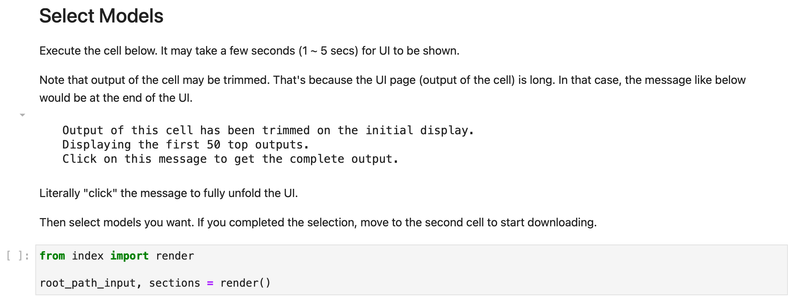
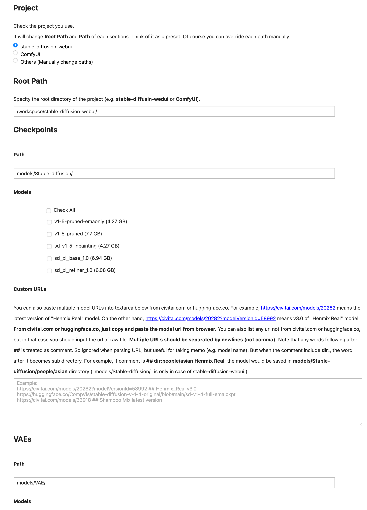
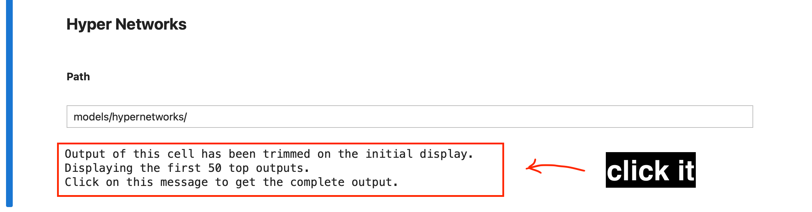
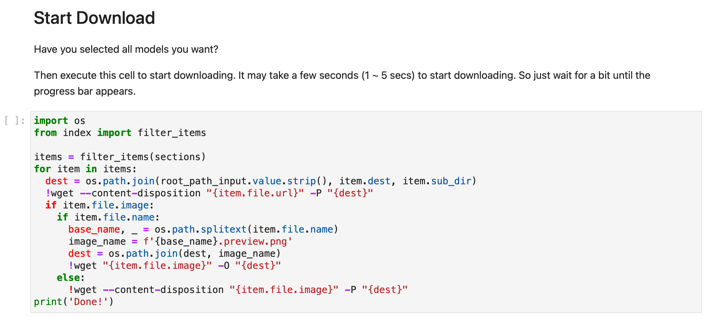
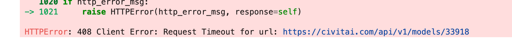
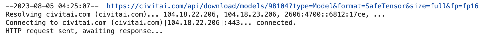

# Stable Diffusion Models Auto Downloader

Jupyter notebook for easily downloading Stable Diffusion models (e.g. checkpoints, VAEs, LoRAs, etc).

This notebook is developed to use services like [runpod.io](https://runpod.io) more conveniently.

But in fact, you can use this notebook in **any environments** (local machine, cloud server, Colab, etc).

## Features

- Automatic Preview Image Download
- Automatically Converts Normal Page URL To Download URL
- Supports Sub-Directory (custom category support)
- Supports Any Project (e.g. stable-diffusion-webui, ComfyUI, etc)
- Custom Download URL

## Usage

### Step 1

Just simply clone the project.

```bash
git clone https://github.com/jjangga0214/sd-models-downloader.git
```

Then open the Jupyter Notebook `sd-models-downloader/index.ipynb`.

### Step 2

A section like the screenshot below would appear.
Execute the cell.

___

___

### Step 3

Now the UI is generated. **(The screenshot below is just part of the whole page.)**

There're sections for Checkpoints, VAEs, Textual Inversions, Hyper Networks, LoRA, LyCORIS, ContrnolNet (v1.0, v1.1), T2I-Adapter, CoAdapter.

___

___

### Step 4

As the UI page (output of the cell) is long, it may be trimmed.
In that case, click the message ("__SHOW MORE OUTPUTS__") like the screenshot below.
It will be at the end of the UI.
Then the full UI will be shown.

___

___

The message can be different by the environment.
For example, it might be like this screenshot below.
___

___

### Step 5

Now it's time to download. Simply execute the cell!

___

___

### Step 6

When you notice you need more models later, then just change the model selection and execute the download cell again.

### Trouble Shooting

#### Timeout

Sometimes the download request is timed out.



This is not a bug at all.
The server may be busy or the network is congested.
CivitAI has a bit higher probability than others like Huggingface.
In this case, just try again!
When the re-trial also fails, you should wait until the server or network gets healthier.
If you don't want to wait, change the URL.

#### Infinite Awaiting

Sometimes download is blocked by infinite awaiting.



This is not a bug either.
You should just wait a minute at first.
But if it doesn't change, you should stop the cell and take an action.
The solution is the same as the "Timeout" section above.

## License

MIT License. Copyright © 2023, GIL B. Chan <github.com/jjangga0214> <bnbcmindnpass@gmail.com>
