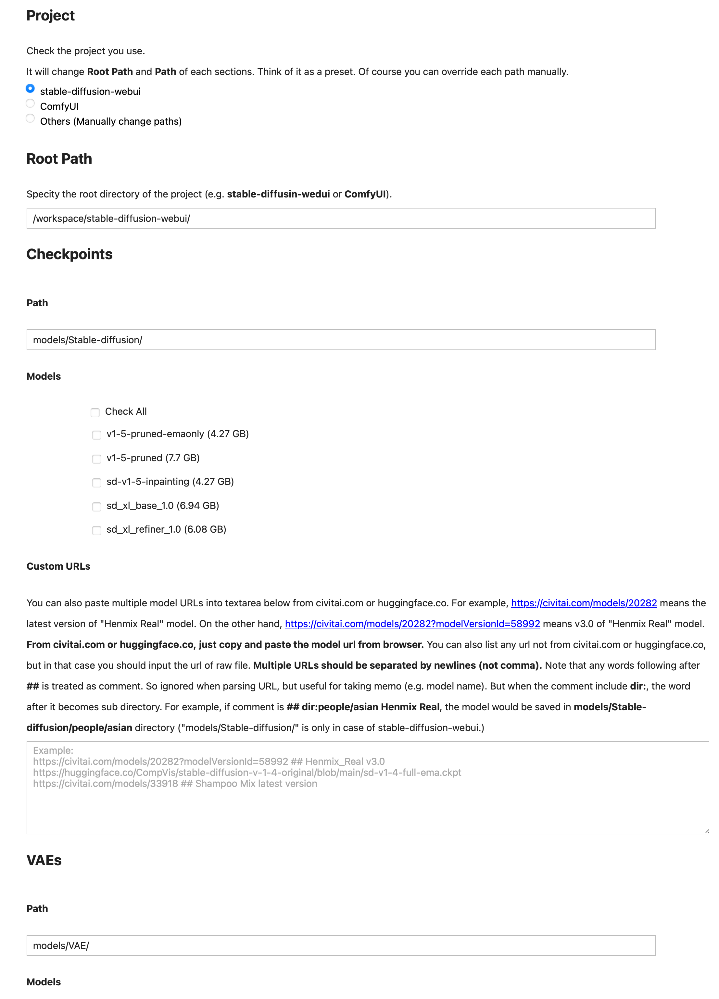
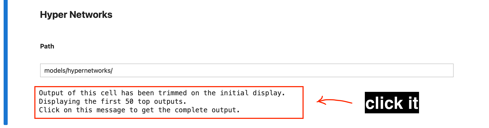

# Stable Diffusion Models Auto Downloader

Jupyter notebook for easily downloading Stable Diffusion models (e.g. checkpoints, VAEs, LoRAs, etc).

This notebook is developed to use services like [runpod.io](https://runpod.io) more conveniently.

But in fact, you can use this notebook in **any environments** (local machine, cloud server, Colab, etc).

## Features

- Automatic Preview Image Download
- Automatically Convert Normal Page URL To Download URL
- Supports Sub-Directory (custom category support)
- Supports Any Project (e.g. stable-diffusion-webui, ComfyUI, etc)
- Custom Download URL

## Usage

### Step 1

Just simply clone the project.

```bash
git clone https://github.com/jjangga0214/sd-models-downloader.git
```

Then open the Jupyter Notebook `sd-models-downloader/index.ipynb`.

### Step 2

A section like the screenshot below would appear.
Execute the cell.

___

___

### Step 3

Now the UI is generated. **(The screenshot below is just part of the whole page.)**

There're sections for Checkpoints, VAEs, Textual Inversions, Hyper Networks, LoRA, LyCORIS, ContrnolNet (v1.0, v1.1), T2I-Adapter, CoAdapter.

___

___

### Step 4

As the UI page (output of the cell) is long, it may be trimmed.
In that case, click the message like the screenshot below.
It will be at the end of the UI.
Then the full UI will be shown.

___

___

### Step 5

Now it's time to download. Simply execute the cell!

___

___

### Step 6

When you notice you need more models later, then just change the model selection and execute the download cell again.

## License

MIT License. Copyright © 2023, GIL B. Chan <github.com/jjangga0214> <bnbcmindnpass@gmail.com>
